# Pricehawk 🦅

## **The Enterprise-Grade Pricing Error Detection Platform**

> **Catch retail pricing glitches before they go viral. Validate with AI. Profit instantly.**

[](LICENSE)


---

## 📉 The Opportunity

In the complex world of algorithmic pricing, retailers make mistakes every single day. Decimal errors, coupon stacking glitches, and currency conversion mishaps create instant arbitrage opportunities.

**The problem?** By the time you see a deal on social media, it's already dead.
**The solution?** Pricehawk.

| Category        | Typical Price | Glitch Price | Potential Profit |
| --------------- | ------------- | ------------ | ---------------- |
| 📺 **OLED TVs** | $2,499        | **$249.99**  | `$2,250`         |
| 💻 **Laptops**  | $1,200        | **$120.00**  | `$1,080`         |
| 🎧 **Audio**    | $350          | **$35.00**   | `$315`           |
| 🏠 **Home**     | $600          | **$60.00**   | `$540`           |

> _Pricehawk monitors 100+ retailers 24/7, detecting anomalies in seconds and delivering them to you before the public finds out._

---

## ⚡ How It Works

Pricehawk combines distributed web scraping with Generative AI to filter out "fake" sales and identify **true pricing errors**.

```mermaid
graph LR
    subgraph Detection ["👁️ Detection Layer"]
        A[Scraper Engine] -->|Raw HTML| B(Price Parser)
        B -->|Price Update| C{Anomaly?}
    end

    subgraph Validation ["🧠 AI Validation Layer"]
        C -->|Yes| D[Context Assembler]
        D -->|History + Competitors| E[DeepSeek V3 Agent]
        E -->|Confidence Score| F{Is Legitimate?}
    end

    subgraph Delivery ["🚀 Delivery Layer"]
        F -->|Yes >80%| G[Notification Router]
        G -->|Instant| H[Discord / SMS]
        G -->|Digest| I[Email / Twitter]
    end

    style Detection fill:#e1f5fe,stroke:#01579b
    style Validation fill:#f3e5f5,stroke:#4a148c
    style Delivery fill:#e8f5e9,stroke:#1b5e20
```



### 🔬 Anomaly Detection Algorithms

Pricehawk employs **5 statistical methods** to identify pricing errors with high precision:

1. **Decimal Error Detection** - Flags prices with ratio < 0.1 or > 10 (e.g., $249.99 vs $2,499)
2. **Z-Score Analysis** - Detects deviations >3σ from historical mean (requires ≥30 samples)
3. **Double MAD (Median Absolute Deviation)** - Asymmetric outlier detection for right-skewed retail pricing
4. **Adjusted IQR with Medcouple** - Boxplot-based outlier detection with skewness correction
5. **Category-Specific Thresholds** - Dynamic sensitivity tuning per product category:
   - 🥫 Grocery: 30% drop threshold (most sensitive)
   - 💻 Electronics/Computers: 40% threshold
   - 👕 Fashion: 60% threshold (least sensitive)
   - 🏠 Home/Toys: 50-55% threshold

All algorithms run in parallel, with confidence scores aggregated for final anomaly classification.

---

## 🏗️ Technical Architecture

Built for speed, reliability, and scale. Pricehawk operates on an event-driven architecture designed to handle thousands of concurrent price checks.

### Core Stack

- **⚡ Framework**: [Next.js 14](https://nextjs.org) (App Router) + TypeScript 5.7
- **🗄️ Database**: [PostgreSQL](https://postgresql.org) + [Prisma ORM 7.2](https://prisma.io)
- **📨 Job Queue**: [BullMQ 5.66](https://bullmq.io) + [Redis 5.10](https://redis.io) Streams
- **🧠 AI Validation**: [DeepSeek V3](https://deepseek.com) via [OpenRouter](https://openrouter.ai)
- **🕷️ Scraping**: Dual-strategy approach
  - [Playwright 1.57](https://playwright.dev) - Browser automation for complex sites
  - [Jina Reader](https://jina.ai) - API-based scraping alternative
- **🔐 Authentication**: [Clerk](https://clerk.dev) + [Stripe 20.1](https://stripe.com) (SaaS tiers)
- **🐳 DevOps**: Docker Compose + Railway deployment

### Background Workers

Six specialized BullMQ workers power the event-driven architecture:

1. **Anomaly Validator** - AI-validates detected pricing errors
2. **Notification Sender** - Multi-channel alert distribution
3. **Deal Verifier** - Re-scrapes active deals to detect expiration
4. **Social Poster** - Publishes to Twitter/X and Facebook
5. **Newsletter Digest** - Batches deals for email/Beehiiv campaigns
6. **Telegram Bot** - Interactive `/deals` command handler

### Notification Channels

Pricehawk delivers alerts across **8 channels** with priority-based routing:

- 🎮 **Discord** - Instant embeds with rich formatting
- 📧 **Email** - Via [Resend](https://resend.com) with daily digest support
- 📱 **SMS** - Via [Twilio](https://twilio.com) (Pro/Elite only)
- 💬 **Telegram** - Direct bot messaging + interactive commands
- 📲 **WhatsApp** - Via Twilio (Pro/Elite only)
- 🐦 **Twitter/X** - OAuth integration for automated posting
- 📘 **Facebook** - Social media presence with engagement tracking
- 🔗 **Webhooks** - Custom integrations for power users

### Capabilities

- **Affiliate Monetization**: Automatically injects affiliate tags (Amazon, etc.) into shared links.
- **Deal Lifecycle**: Auto-expires deals when prices return to normal via verification worker.
- **Smart Filtering**: Subscribers set min/max prices, categories, retailers, and profit margins.
- **Temporal Context**: Detection adjusts confidence during known maintenance windows (2-5 AM).
- **Chart Generation**: Price history visualization with Sharp image processing.
- **Audit Logging**: Comprehensive event tracking for compliance and debugging.

---

## 🚀 Getting Started

Deploying Pricehawk requires Docker, PostgreSQL, Redis, and several API keys for full functionality.

### 1. Requirements

- **Docker** & Docker Compose
- **API Keys** (see [.env.example](.env.example) for complete list):
  - OpenRouter (AI validation)
  - Clerk (authentication)
  - Stripe (payments)
  - Twilio (SMS/WhatsApp - optional)
  - Twitter/X API (social posting - optional)
  - Telegram Bot Token (notifications - optional)
  - Resend (email - optional)

### 2. Run with Docker Compose

```bash
# Clone the repository
git clone https://github.com/clduab11/pricehawk.git
cd pricehawk

# Copy environment template and configure keys
cp .env.example .env
# Edit .env with your API keys

# Start the full stack (App + Workers + DB + Redis)
docker compose up --build -d
```

### 3. Initialize Database

```bash
# Generate Prisma client
npm run prisma:generate

# Run migrations
npx prisma migrate deploy

# Seed initial data (optional)
npm run db:seed
```

### 4. Access the Dashboard

Visit `http://localhost:3000` to access the admin console and view live pricing feeds.

### 5. Start Workers (Optional)

Workers can run in Docker or separately for development:

```bash
# Run all workers
npm run worker

# Or run specific workers
npm run worker:validate  # Anomaly validator
npm run worker:notify    # Notification sender
```

---

## 💰 Business Model

Pricehawk operates as a **SaaS platform** with three monetization channels:

### Subscription Tiers (Stripe Integration)

| Tier          | Price/mo | Features                                                                 |
| ------------- | -------- | ------------------------------------------------------------------------ |
| **Free**      | $0       | Discord alerts, Email digest, 3 tracked products                         |
| **Starter**   | $9.99    | + Twitter, Telegram, 10 tracked products                                 |
| **Pro**       | $29.99   | + SMS, WhatsApp, Priority routing, 50 products                           |
| **Elite**     | $99.99   | + API access, Custom webhooks, Unlimited products, White-label dashboard |

### Revenue Streams

1. **💳 SaaS Subscriptions** - Tiered access with feature gating (60% of revenue)
2. **🔗 Affiliate Commissions** - Automatic tag injection on all shared deal links (25%)
3. **🔌 API Licensing** - Enterprise data stream for high-volume resellers (10%)
4. **📊 Data Reselling** - Anonymized pricing trends to market research firms (5%)


### Subscriber Preferences

Users can fine-tune notifications by:
- **Categories**: Electronics, Fashion, Home, Toys, Grocery, etc.
- **Retailers**: Amazon, Best Buy, Walmart, Target, etc.
- **Price Range**: Min/max thresholds
- **Profit Margin**: Only notify if potential profit > $X
- **Channel Selection**: Enable/disable specific notification types

---

## 🗺️ Roadmap

- [x] **Phase 1: Foundation** - Scrapers, PostgreSQL + Prisma, Clerk Auth
- [x] **Phase 2: Intelligence** - Multi-algorithm anomaly detection, Redis + BullMQ pipeline
- [x] **Phase 3: AI Validation** - DeepSeek V3 integration, context-aware confidence scoring
- [x] **Phase 4: Expansion** - Twitter/X, Telegram bot, Facebook, WhatsApp, SMS via Twilio
- [x] **Phase 5: Monetization** - Stripe SaaS tiers, affiliate injection, subscription management
- [ ] **Phase 6: Mobile** - React Native app with push notifications
- [ ] **Phase 7: Global** - International retailer support (UK, EU, Asia)
- [ ] **Phase 8: Advanced Analytics** - Price prediction ML models, competitor analysis dashboards

---

## 🤝 Contributing

We welcome contributions! Please see [CONTRIBUTING.md](CONTRIBUTING.md) for details.

### License

Pricehawk is dual-licensed:

- **ELv2**: Free for personal/non-commercial use.
- **Commercial**: Required for business use or resale.

---

<div align="center">
  <sub>Built with 🦅 by Parallax Analytics</sub>
</div>
