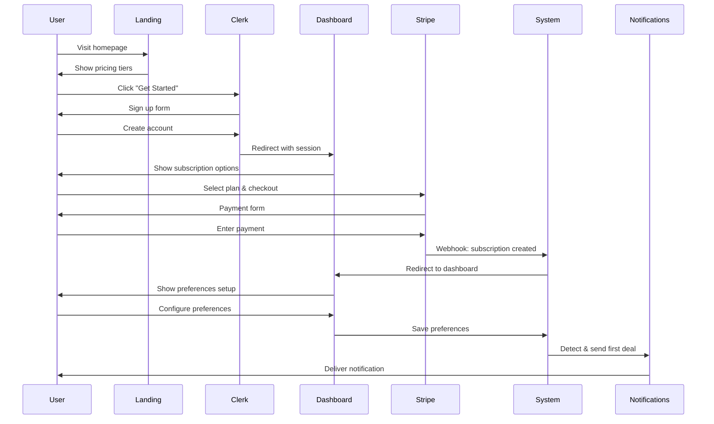
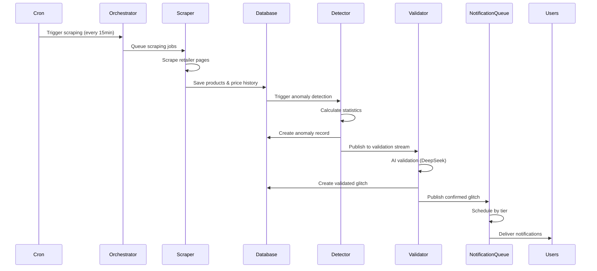
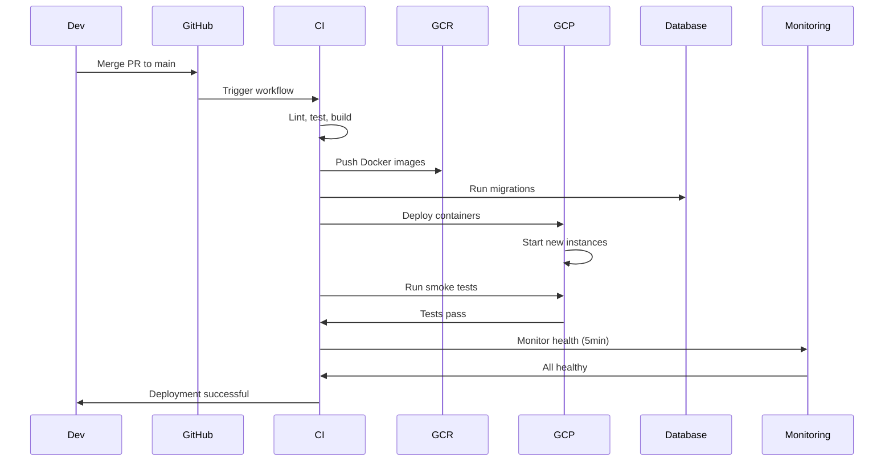
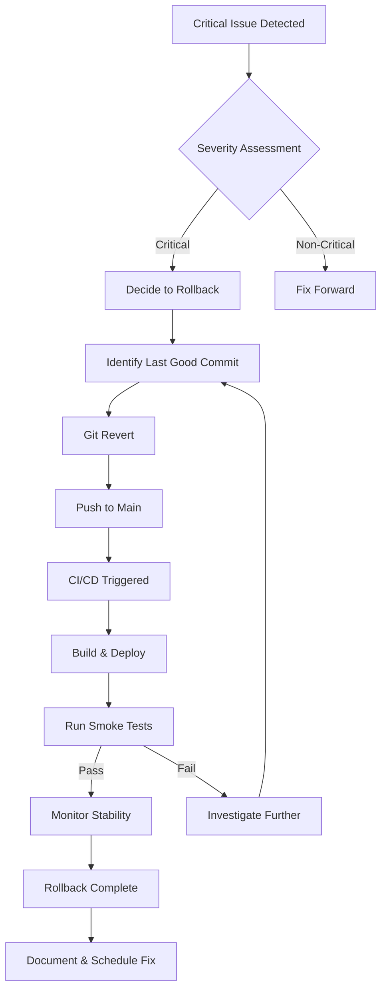

# Core Flows: Production Readiness

# Core Flows: Production Readiness

This document defines the critical user and operational flows for PriceHawk's production launch. These flows must work flawlessly for a successful launch to 10-50 initial users.

---

## 1. User Onboarding Flow

**Description:** New user discovers PriceHawk, signs up, subscribes to a paid plan, and receives their first deal notification.

**Trigger:** User visits landing page or pricing page

**Steps:**

1. **Landing & Discovery**
   - User arrives at homepage or pricing page
   - Reviews subscription tiers and features
   - Clicks "Get Started" or "Subscribe" button

2. **Authentication**
   - Redirected to Clerk sign-up page
   - User creates account with email/password or OAuth (Google, Twitter)
   - Clerk creates user session and redirects to dashboard

3. **Subscription Selection**
   - User views pricing options (Starter, Pro, Elite)
   - Selects tier and billing cycle (monthly/annual)
   - Clicks "Subscribe" button

4. **Checkout**
   - System creates Stripe Checkout session
   - User redirected to Stripe-hosted checkout page
   - User enters payment details and completes purchase
   - Stripe webhook confirms subscription creation
   - User redirected back to dashboard with success message

5. **Preferences Configuration**
   - Dashboard displays "Set Your Preferences" prompt
   - User navigates to preferences page
   - Configures notification channels (email, SMS, Telegram, WhatsApp, Discord)
   - Sets deal filters (retailers, categories, price range, profit margin)
   - Saves preferences

6. **First Notification**
   - System detects next pricing glitch matching user preferences
   - Notification delivered via user's selected channels
   - User receives welcome email with setup confirmation

**Exit:** User has active subscription and is receiving deal notifications

**Success Criteria:**
- Signup to first notification < 5 minutes
- Zero payment failures for valid cards
- All notification channels work on first attempt

---

## 2. Deal Detection & Notification Flow

**Description:** System continuously scrapes retailers, detects pricing anomalies, validates them with AI, and notifies users based on subscription tier.

**Trigger:** Scheduled scraping job (every 15 minutes) or manual trigger

**Steps:**

1. **Scraping Initiation**
   - Cron job or orchestrator triggers scraping for configured retailers
   - Jobs queued in Redis with retailer and category information
   - Worker picks up job from queue

2. **Product Scraping**
   - Worker selects scraping strategy (Playwright or Jina) based on retailer config
   - Navigates to retailer product pages
   - Extracts product data (title, price, original price, URL, image)
   - Handles anti-bot measures (rate limiting, proxy rotation, delays)
   - Returns scraped products

3. **Data Persistence**
   - Products upserted to database (create new or update existing)
   - Price history recorded for each product
   - Timestamp updated to track scraping freshness

4. **Anomaly Detection**
   - System calculates price statistics from historical data
   - Compares current price against historical average
   - Detects anomalies using z-score and discount percentage
   - Creates anomaly record with confidence score
   - Publishes anomaly to validation stream

5. **AI Validation**
   - Validation worker reads anomaly from stream
   - Sends product data to AI model (DeepSeek via OpenRouter)
   - AI determines if anomaly is genuine pricing glitch
   - Returns confidence score, glitch type, and reasoning
   - Creates validated glitch record if confirmed

6. **Notification Queueing**
   - System publishes confirmed glitch to notification stream
   - Notification worker reads from stream
   - Schedules notifications by tier:
     - Pro/Elite: Immediate (0 delay)
     - Starter: 24-hour delay
     - Free: 72-hour delay
   - Sends immediate broadcast to public channels (Discord, Facebook)

7. **Notification Delivery**
   - Delayed notification jobs execute at scheduled time
   - System queries eligible subscribers by tier and preferences
   - Filters glitches based on user preferences (retailers, categories, price range)
   - Sends notifications via enabled channels (email, SMS, Telegram, WhatsApp, Discord)
   - Records delivery status and marks anomaly as "notified"

**Exit:** Users receive deal notifications according to their subscription tier

**Success Criteria:**
- 95%+ deal detection accuracy (no false positives)
- < 1 minute from detection to Pro/Elite notification
- All notification channels deliver successfully
- No duplicate notifications for same glitch

---

## 3. Production Deployment Flow (GCP)

**Description:** Code changes are merged, built, tested, and deployed to Google Cloud Platform with validation.

**Trigger:** Pull request merged to main branch

**Steps:**

1. **CI Pipeline Initiation**
   - GitHub Actions workflow triggered on push to main
   - Checkout code and setup Node.js environment
   - Install dependencies and generate Prisma client

2. **Build & Test**
   - Run linting (ESLint) and type checking (TypeScript)
   - Run unit tests (Vitest)
   - Build Next.js application
   - Build Docker images (app and worker)
   - Push images to Google Container Registry (GCR)

3. **Database Migration**
   - Run Prisma migration check
   - If schema changed, run `prisma migrate deploy` against production database
   - Verify migration success before proceeding

4. **Deployment to GCP**
   - Deploy app container to Cloud Run (Next.js application)
   - Deploy worker containers to Cloud Run Jobs or GKE (scraper, validator, notifier)
   - Update environment variables and secrets
   - Configure health check endpoints

5. **Smoke Testing**
   - Wait for deployment to stabilize (30 seconds)
   - Run automated smoke tests against production:
     - Health check: `GET /api/health` returns 200
     - Auth check: Clerk authentication works
     - Database check: Can query database
     - Stripe check: Can create checkout session
     - Worker check: Jobs are processing
   - All tests must pass to proceed

6. **Health Validation**
   - Monitor health endpoint for 5 minutes
   - Check error rates in logs
   - Verify workers are processing jobs
   - Confirm no spike in error alerts

7. **Deployment Complete**
   - Mark deployment as successful in GitHub
   - Send deployment notification email
   - Update deployment log with version and timestamp

**Exit:** New version running in production, all systems healthy

**Success Criteria:**
- Zero-downtime deployment
- All smoke tests pass
- Health checks green for 5 minutes
- No rollback required

---

## 4. Monitoring & Alerting Flow

**Description:** System continuously collects metrics, visualizes them in Grafana, and sends email alerts for critical issues.

**Trigger:** Continuous (metrics collected every minute)

**Steps:**

1. **Metrics Collection**
   - Application emits metrics to Redis:
     - Scraping success/failure rates
     - Anomaly detection counts
     - Notification delivery status
     - API response times
     - Database query performance
     - Worker job processing rates
   - Prometheus scrapes metrics from `/api/internal/metrics` endpoint
   - Metrics stored in Prometheus time-series database

2. **Visualization**
   - Grafana connects to Prometheus data source
   - Dashboards display key metrics:
     - System health overview
     - Scraping performance
     - Deal detection pipeline
     - Notification delivery rates
     - Error rates and latency
   - Operator can view real-time and historical data

3. **Alert Evaluation**
   - Prometheus evaluates alert rules every minute:
     - High error rate (> 5% of requests)
     - Scraping failures (> 20% failure rate)
     - Worker queue backlog (> 100 pending jobs)
     - Database connection failures
     - Health check failures
     - Notification delivery failures (> 10%)

4. **Alert Notification**
   - When alert threshold exceeded, Prometheus triggers alert
   - Alert sent to configured email address
   - Email includes:
     - Alert severity (warning/critical)
     - Affected component
     - Current metric value
     - Link to Grafana dashboard
     - Suggested troubleshooting steps

5. **Alert Resolution**
   - Operator investigates and resolves issue
   - Metrics return to normal thresholds
   - Prometheus marks alert as resolved
   - Resolution email sent to operator

**Exit:** Operator has visibility into system health and receives timely alerts

**Success Criteria:**
- Metrics updated every minute
- Alerts delivered within 2 minutes of threshold breach
- Zero false positive alerts
- Dashboard accessible 24/7

---

## 5. Incident Response Flow

**Description:** When an alert is received, operator investigates, diagnoses, and resolves the issue using different workflows based on alert type.

**Trigger:** Email alert received from monitoring system

**Steps:**

1. **Alert Triage**
   - Operator receives email alert
   - Reviews alert severity and affected component
   - Determines incident type:
     - **Type A:** Application errors (5xx responses, crashes)
     - **Type B:** Worker failures (scraping, validation, notification)
     - **Type C:** Database issues (connection failures, slow queries)
     - **Type D:** External service failures (Stripe, Clerk, APIs)
     - **Type E:** Performance degradation (high latency, timeouts)

2. **Investigation Path (by Type)**

   **Type A - Application Errors:**
   - Check Grafana dashboard for error spike
   - Review application logs in GCP Cloud Logging
   - Identify error pattern (specific endpoint, user action)
   - Check recent deployments for correlation
   - Decision: Fix forward or rollback?

   **Type B - Worker Failures:**
   - Check worker logs in GCP Cloud Logging
   - Review Redis queue status (backlog size)
   - Check external API status (scraping targets, AI services)
   - Verify worker containers are running
   - Decision: Restart workers or fix configuration?

   **Type C - Database Issues:**
   - Check database health endpoint
   - Review slow query logs
   - Check connection pool status
   - Verify database provider status (Neon/Supabase)
   - Decision: Optimize queries or scale database?

   **Type D - External Service Failures:**
   - Check service status pages (Stripe, Clerk, OpenRouter)
   - Review API error responses in logs
   - Verify API keys and credentials
   - Check rate limiting status
   - Decision: Wait for recovery or implement fallback?

   **Type E - Performance Degradation:**
   - Check resource utilization (CPU, memory, network)
   - Review slow endpoint logs
   - Check database query performance
   - Verify worker concurrency settings
   - Decision: Scale resources or optimize code?

3. **Resolution Action**
   - Execute appropriate fix based on investigation
   - Monitor metrics to confirm resolution
   - Verify alert clears in Prometheus
   - Document incident and resolution in log

4. **Post-Incident**
   - Write brief postmortem (what happened, why, how fixed)
   - Identify preventive measures
   - Update runbooks if new pattern discovered
   - Schedule follow-up work if needed

**Exit:** Issue resolved, system healthy, incident documented

**Success Criteria:**
- Mean time to resolution < 30 minutes for critical issues
- All incidents documented
- No repeat incidents from same root cause

---

## 6. Deployment Rollback Flow

**Description:** When a deployment causes critical issues, quickly revert to the previous stable version.

**Trigger:** Critical bug discovered in production or failed smoke tests

**Steps:**

1. **Rollback Decision**
   - Operator identifies critical issue caused by recent deployment
   - Confirms rollback is necessary (issue severity, user impact)
   - Identifies last known good commit/version

2. **Git Revert**
   - Checkout main branch locally
   - Run `git revert <commit-hash>` for problematic commit
   - Or `git revert HEAD` if most recent commit
   - Push revert commit to main branch

3. **Automatic Redeployment**
   - GitHub Actions triggered by push to main
   - CI pipeline runs (lint, test, build)
   - Docker images built with reverted code
   - Deployed to GCP following normal deployment flow

4. **Validation**
   - Run smoke tests against reverted deployment
   - Verify issue is resolved
   - Check metrics for return to normal
   - Monitor for 10 minutes to ensure stability

5. **Communication**
   - Document rollback reason and resolution
   - If users were affected, send status update
   - Create issue to fix root cause properly
   - Schedule fix for next deployment

**Exit:** System running previous stable version, issue mitigated

**Success Criteria:**
- Rollback completed within 10 minutes
- System returns to stable state
- No data loss during rollback
- Root cause documented for future fix

---

## 7. Database Backup & Recovery Flow

**Description:** Minimal backup strategy for small launch, with plan to enhance as user base grows.

**Trigger:** Manual backup before major changes or deployments

**Steps:**

1. **Pre-Deployment Backup**
   - Before deploying schema changes or major features
   - Operator triggers manual backup via database provider UI
   - Or runs backup script: `pg_dump` for PostgreSQL
   - Backup stored in GCP Cloud Storage
   - Verify backup file created successfully

2. **Automated Daily Backups (Future)**
   - Configure database provider's automated backup feature
   - Set retention policy (7 days for now)
   - Backups run daily at low-traffic time (3 AM UTC)
   - Verify backup success via email notification

3. **Recovery (If Needed)**
   - Identify backup to restore from
   - Stop application and workers to prevent writes
   - Restore database from backup file
   - Run any necessary migrations
   - Restart application and workers
   - Verify data integrity

**Exit:** Database backed up and recoverable if needed

**Success Criteria:**
- Backup before every schema change
- Backup files accessible and valid
- Recovery tested at least once

---

## Flow Priorities for Production Launch

**Must Work Flawlessly (P0):**
1. User Onboarding Flow - Users must be able to sign up and subscribe
2. Deal Detection & Notification Flow - Core value proposition
3. Production Deployment Flow - Must deploy reliably
4. Incident Response Flow - Must handle issues quickly

**Should Work Well (P1):**
5. Monitoring & Alerting Flow - Visibility into system health
6. Deployment Rollback Flow - Safety net for bad deployments

**Can Enhance Later (P2):**
7. Database Backup & Recovery Flow - Minimal for small launch

---

## Success Metrics

- **User Onboarding:** 90%+ completion rate from signup to first notification
- **Deal Detection:** 95%+ accuracy, < 1 minute latency for Pro/Elite
- **Deployment:** 100% success rate, zero downtime
- **Monitoring:** < 2 minute alert delivery, zero false positives
- **Incident Response:** < 30 minute MTTR for critical issues
- **Rollback:** < 10 minute rollback time when needed